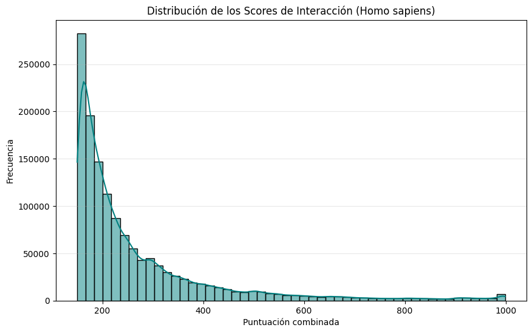
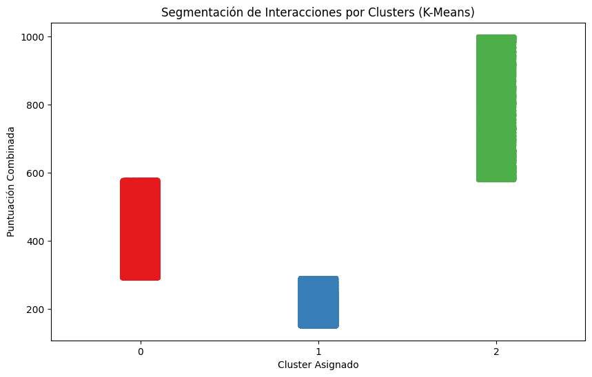

# Introducción y Objetivo
El presente análisis utiliza el dataset de STRING-db para Homo sapiens, el cual contiene registros de interacciones proteína-proteína cuantificadas mediante una puntuación combinada (combined_score). El objetivo es aplicar técnicas de Big Data y Aprendizaje No Supervisado para identificar patrones de confianza en la red de interacciones biológicas.

# Análisis Exploratorio de Datos (EDA)
Antes del modelado, se analizó la distribución de la variable principal:

* Distribución de Scores: Como se observa en el histograma, el conjunto de datos presenta un sesgo positivo pronunciado. La gran mayoría de las interacciones se concentran en el rango de 150 a 300 puntos.

* Observación: Existe una frecuencia mínima pero constante a lo largo del espectro, con un pequeño repunte cerca del score máximo (1000), lo que sugiere que las interacciones de "extrema confianza" son una minoría selecta en el genoma humano.

---
# Implementación

Se aplicó el algoritmo K-Means utilizando la librería distribuida de Spark para segmentar las interacciones en 3 grupos (k=3), basándose en la premisa de que biológicamente existen niveles de confianza: Bajo, Medio y Alto.

## Evaluación del Modelo

- **Coeficiente de Silhouette**: 0.8237.

    > **Interpretación**: Este valor indica que los clusters están muy bien definidos y la distancia entre grupos es significativamente mayor que la distancia interna de los puntos en cada grupo.

- **Centros de Clusters**: Los centros normalizados reflejan la jerarquía de los datos, posicionando a los grupos en niveles de intensidad claramente diferenciados.

# Resultados

La gráfica de dispersión de clusters (Stripplot) muestra una separación casi perfecta:

- Cluster 1 (Azul): Representa las interacciones de Baja Confianza (aprox. 150 - 300). Es el grupo más denso y poblado.

- Cluster 0 (Rojo): Segmenta las interacciones de Confianza Media (aprox. 300 - 600).

- Cluster 2 (Verde): Agrupa las interacciones de Alta Confianza (600 - 1000).

---

# Conclusiones

El uso de PySpark permitió procesar la totalidad del dataset de interacciones humanas de manera eficiente. El modelo de clustering validó estadísticamente los umbrales de confianza que a menudo se proponen de forma manual en bioinformática. La alta métrica de Silhouette confirma que el combined_score es una variable robusta para la clasificación automática de la relevancia de interacciones proteicas.